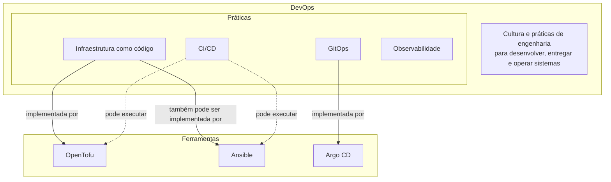
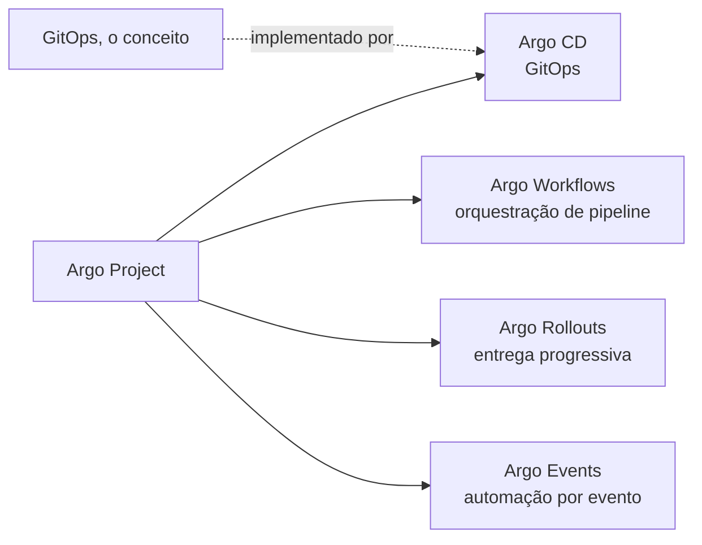

# Mapa de DevOps, IaC e GitOps

Uma confusão comum ao ler sobre este tipo de repositório é tratar prática e ferramenta como sinônimos: dizer que "o [Ansible](ansible.md) é DevOps" ou que "o Argo é [GitOps](argocd.md)" mistura níveis diferentes de abstração. DevOps é a cultura e o conjunto de práticas de engenharia para desenvolver, entregar e operar sistemas, e dentro dele existem práticas mais específicas, como [infraestrutura como código](iac/index.md), [GitOps](argocd.md), [integração contínua](ci-cd.md) e observabilidade.

Cada uma dessas práticas é implementada por uma ou mais ferramentas concretas, que por sua vez não pertencem exclusivamente a uma única prática.

Separar os dois níveis rende na hora de trocar de ferramenta: a prática continua de pé, e o que está em discussão é apenas qual implementação dela o projeto prefere.

A relação entre infraestrutura como código e suas ferramentas já tem uma página própria, [Infraestrutura como código](iac/index.md), que separa a família de provisionamento (Terraform, Pulumi e OpenTofu, que criam e destroem recursos) da família de gestão de configuração ([Ansible](ansible.md), Puppet e Chef, que configuram uma máquina que já existe).

O ponto que vale reforçar aqui é que essas famílias não são práticas concorrentes. Uma ferramenta de provisionamento cria a máquina e uma de configuração prepara o que roda dentro dela, de modo que um mesmo projeto pode usar ambas em sequência, uma entregando o resultado para a outra.

## Uma ferramenta pode pertencer a mais de uma prática

[Ansible](ansible.md) é o exemplo mais direto: ele implementa [infraestrutura como código](iac/index.md) quando o assunto é configuração de máquina, mas o mesmo Ansible também orquestra, via módulo de comando ou de API, chamadas que não têm nada de declarativo, como rodar um comando pontual de manutenção. Chamar Ansible de "a ferramenta de IaC" simplificaria demais o que ele faz de fato.

As duas faces podem aparecer lado a lado no mesmo playbook: algumas roles descrevem estado, enquanto outras chegam ao resultado desejado disparando comandos e interpretando sua saída para decidir se algo mudou.

| Identificador | Onde aparece |
| --- | --- |
| playbook | arquivo que encadeia as roles |
| role declarativa | role que descreve estado |
| role imperativa | role que dispara um comando |
| comando externo | comando cuja saída é interpretada |

O mesmo cuidado vale para conjuntos de ferramentas publicados sob um nome guarda-chuva. O Argo Project, por exemplo, é uma coleção de projetos distintos mantidos sob o mesmo guarda-chuva CNCF: Argo CD ([GitOps](argocd.md) para [Kubernetes](k3s.md)), Argo Workflows (orquestração de pipelines dentro do cluster), Argo Rollouts (entrega progressiva, canário e blue-green) e Argo Events (automação disparada por evento). [GitOps](argocd.md) é a prática; [ArgoCD](argocd.md) é uma implementação dela.

O Argo Project não está contido em GitOps, é o inverso parcial: um dos projetos do Argo implementa [GitOps](argocd.md), os demais resolvem problemas diferentes que nada têm a ver com sincronizar um cluster a partir de um repositório git.

## Continue por aqui

[Infraestrutura como código](iac/index.md) aprofunda a distinção entre provisionamento e gestão de configuração; [Ansible](ansible.md) e [ArgoCD e GitOps](argocd.md) detalham cada ferramenta específica; [CI/CD](ci-cd.md) cobre a outra prática citada aqui.
